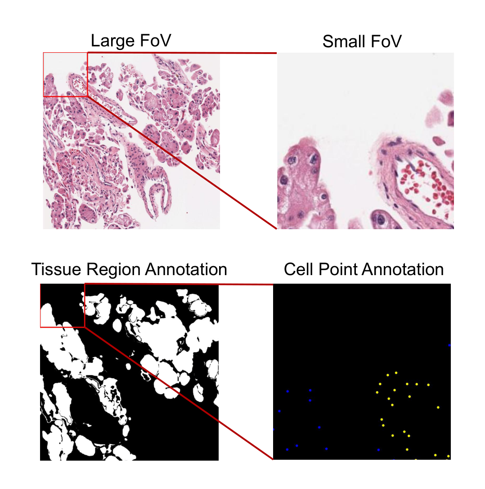
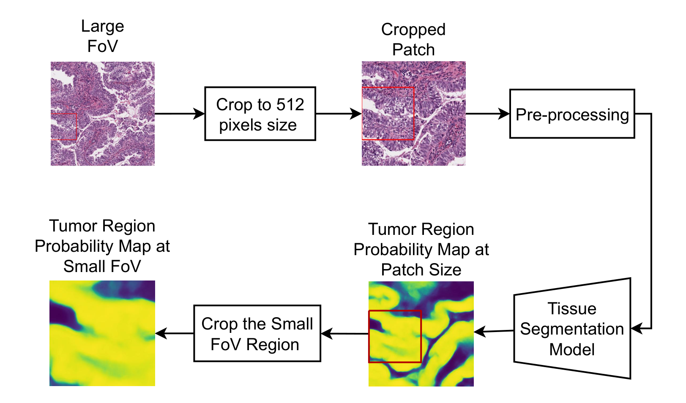
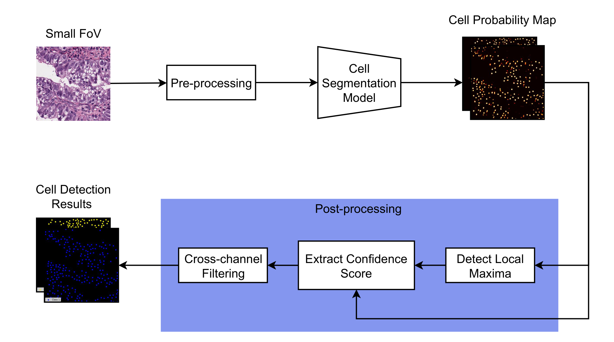
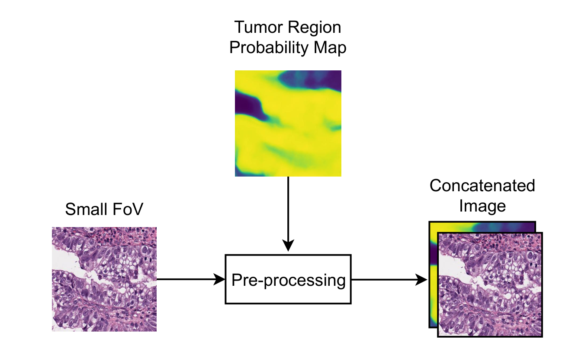
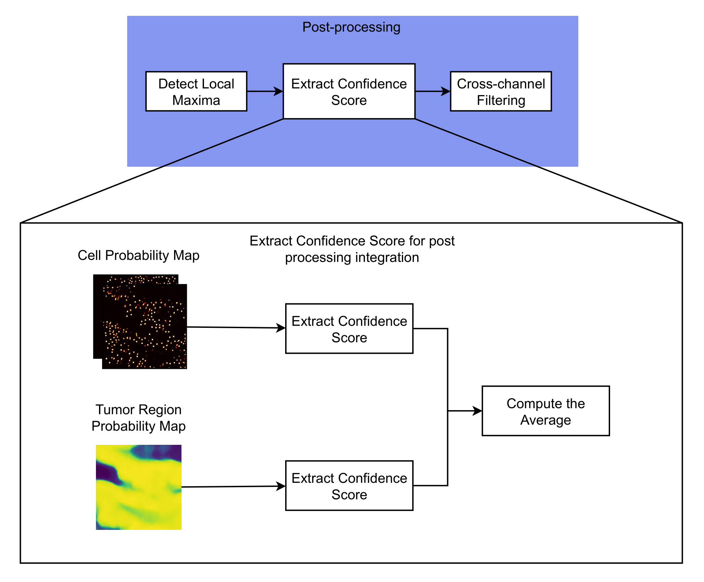
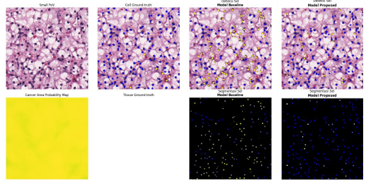
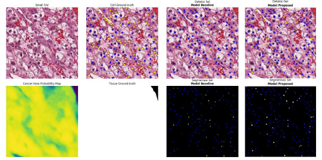

# Evaluation of Integration Strategies for Tumor Cell Detection on the OCELOT Dataset

**Dwi Rezky Fahlan, Allya Paramita Koesoema, Windy Gambetta**  
School of Electrical Engineering and Informatics, Institut Teknologi Bandung

> Paper submitted to IUPESM 2025. Pre-print available upon request.

---

## Overview

The OCELOT dataset enables feature sharing between tissue segmentation and cell detection, yet the impact of different integration strategies on cell detection performance remains underexplored. We systematically evaluate **pre-processing** and **post-processing** integration strategies under a consistent pipeline. Pre-processing integration achieves the highest overall mF1 (0.6929) and the largest improvement over the no-integration baseline (+0.1205) among related works on the same evaluation set. Post-processing integration yields the highest tumor cell recall. Both strategies outperform the baseline, and the detailed comparison provides practical guidance for designing integration strategies in future multi-task cell detection research.

---

## Dataset

The [OCELOT 2023](https://ocelot.grand-challenge.org/) dataset contains dual-scale histopathology image pairs collected from 306 TCGA WSIs across 6 organs (kidney, head-and-neck, prostate, stomach, endometrium, bladder). Annotations were produced by board-certified pathologists.

| Property | Detail |
|---|---|
| Total samples | 673 (train / val / test: ~400 / 137 / 126) |
| Small FoV resolution | ~0.19 µm/px (cell-scale) |
| Large FoV resolution | ~0.77 µm/px (tissue-scale) |
| Cell annotation | Point annotations: **tumor cell** / **background cell** (balanced) |
| Tissue annotation | Pixel-level: **cancer area** / **non-cancer area** |

EDA findings that motivated design decisions are in [`eda/README.md`](eda/README.md).

<p align="center">
  
  <br><em>Fig. 1. A sample from the OCELOT dataset.</em>
</p>

---

## Method

### Pipeline Overview

The pipeline consists of two stages run sequentially:

**Stage 1 — Tissue Segmentation:**  
A **U-Net++ with SE-ResNet50 encoder** (pretrained on ImageNet, fine-tuned on OCELOT) generates a tumor region probability map from the large FoV. During inference, a 512×512 patch centered on the small FoV is extracted from the large FoV and fed to the model; the output is then cropped to the exact small FoV region. This allows the model to use surrounding tissue context beyond the small FoV boundary.

<p align="center">
  
  <br><em>Fig. 2. Tissue segmentation pipeline.</em>
</p>

**Stage 2 — Cell Detection:**  
An **Attention U-Net with ResNet34 encoder** (pretrained on ImageNet, fine-tuned on OCELOT) takes the small FoV as input and outputs a two-channel cell probability map (one channel per class). Post-processing detects local maxima, extracts confidence scores, and applies cross-channel filtering to resolve conflicting predictions.

<p align="center">
  
  <br><em>Fig. 3. Cell detection pipeline.</em>
</p>

### Integration Strategies

The tumor region probability map from Stage 1 is injected into Stage 2 at two different points:

| Strategy | Where | How |
|---|---|---|
| **Baseline** | — | No integration; cell detection uses only the small FoV |
| **Pre-processing** | Input | Tumor probability map concatenated to the small FoV → 4-channel input |
| **Post-processing** | Confidence scoring | Gaussian-weighted sampling from the tumor probability map refines per-cell confidence scores before cross-channel filtering |

The pre-processing strategy allows the model to **learn from tissue context during training**. The post-processing strategy is training-free and provides greater flexibility, but the model itself receives no tissue information during learning.

<p align="center">
  
  <br><em>Fig. 4. Pre-processing stage integration.</em>
</p>

<p align="center">
  
  <br><em>Fig. 5. Post-processing stage integration.</em>
</p>

---

## Results

### Tissue Segmentation

Our U-Net++ model outperforms the SoftCTM baseline on both splits:

| Method | Val mF1 | Test mF1 |
|---|---|---|
| **Our method** | **0.9048** | **0.9092** |
| SoftCTM | 0.8571 | 0.8951 |

Performance of the tumor probability map cropped to the small FoV region (the actual input to Stage 2):

| Split | F1 (non-cancer) | F1 (cancer) | mF1 |
|---|---|---|---|
| Train | 0.9568 | 0.9432 | 0.9500 |
| Val | 0.9051 | 0.8733 | 0.8892 |
| Test | 0.9013 | 0.8913 | 0.8963 |

### Cell Detection

| Integration | Set | BG Precision | BG Recall | BG F1 | Tumor Precision | Tumor Recall | Tumor F1 | **mF1** |
|---|---|---|---|---|---|---|---|---|
| No-integration | Val | 0.5162 | 0.5445 | 0.5300 | 0.7441 | 0.6297 | 0.6821 | 0.6060 |
| No-integration | Test | 0.6411 | 0.3937 | 0.4878 | 0.6046 | 0.7191 | 0.6569 | 0.5724 |
| Pre-processing | Val | 0.5826 | **0.7076** | **0.6391** | **0.8088** | 0.6770 | **0.7370** | **0.6881** |
| Pre-processing | Test | 0.6762 | 0.6521 | **0.6639** | 0.7282 | 0.7156 | **0.7218** | **0.6929** |
| Post-processing | Val | 0.5698 | 0.6037 | 0.5862 | 0.7828 | 0.6606 | 0.7165 | 0.6514 |
| Post-processing | Test | **0.6972** | 0.4632 | 0.5566 | 0.6402 | **0.7375** | 0.6854 | 0.6210 |

### Comparison with Prior Work (Test Set)

| Method | mF1 | mF1 Improvement |
|---|---|---|
| Ji et al. | 0.7056 | +0.0166 |
| Ryu et al. | 0.7123 | +0.0679 |
| **Our method (pre-processing)** | **0.6929** | **+0.1205** |

Our method achieves the **largest mF1 improvement** (+0.1205) among reported methods on this evaluation set, despite using a lightweight architecture (Attention U-Net + ResNet34). This validates the hypothesis that maximizing tissue segmentation quality translates directly into cell detection gains.

### Key Takeaway

- **Pre-processing integration** achieves the best overall mF1 and is well-balanced across both classes — recommended when training resources are available.
- **Post-processing integration** achieves the highest tumor cell recall (0.7375 on test), which is particularly relevant in clinical settings where missing a tumor cell is costly — and requires no retraining.
- When the tumor region probability map is reliable, integration leads to noticeably more accurate tumor cell detection (Fig. 6). However, when tumor cells are dispersed among background cells, the spatial context from the probability map provides limited benefit even if the map itself is reliable (Fig. 7).

### Qualitative Results

<p align="center">
  
  <br><em>Fig. 6. Success case.</em>
</p>

<p align="center">
  
  <br><em>Fig. 7. Limitation case.</em>
</p>

---

## Repository Structure

```
├── notebooks/
│   ├── README.md                                          ← notebook index + Google Drive links
│   ├── 01_eda_preprocessing.ipynb                        ← EDA and data preprocessing
│   ├── 02_tissue_segmentation.ipynb                      ← tissue segmentation model
│   ├── 03_baseline_modeling.ipynb                        ← baseline cell detection (no integration)
│   ├── 04_preprocessing_integration.ipynb                ← pre-processing stage integration
│   └── 05_postprocessing_integration.ipynb               ← post-processing stage integration
├── eda/
│   └── README.md                                         ← EDA findings and design decisions
├── assets/                                               ← figures
└── requirements.txt
```

---

## Reproducibility Note

All experiments were run on **Google Colab** (GPU runtime, Python 3). Data is loaded from Google Drive. Notebooks in this repository are stripped of outputs to keep file sizes manageable. Full notebooks with all outputs are linked in [`notebooks/README.md`](notebooks/README.md).

The OCELOT dataset is publicly available at the [official challenge page](https://ocelot.grand-challenge.org/).

---

## Citation

```
Fahlan, D.R., Koesoema, A.P., Gambetta, W. (2025). Evaluation of the Impact of Different
Integration Strategies on Cell Detection Performance: A Study on the OCELOT Dataset.
IUPESM 2025.
```
