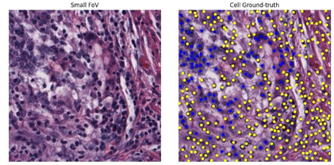
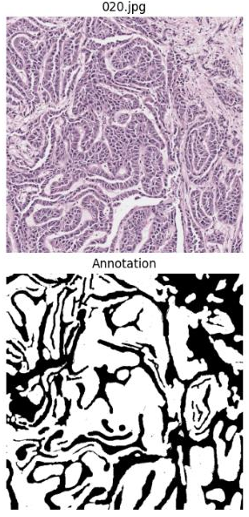
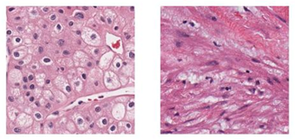
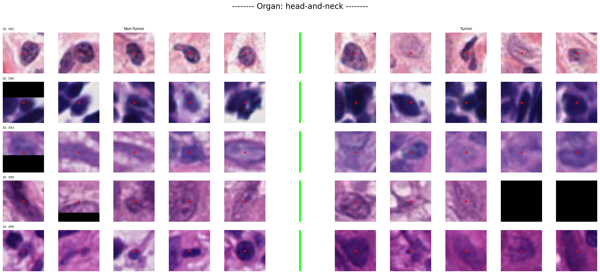
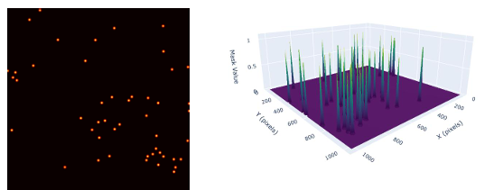
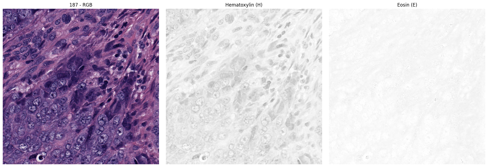
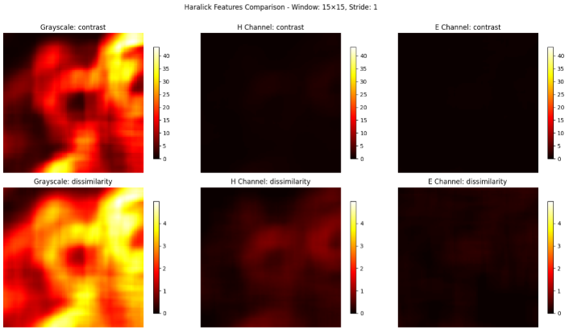

# EDA Findings

Key observations from exploratory analysis of the OCELOT 2023 dataset, and the design decisions they led to. Full notebook: [`../notebooks/01_eda_preprocessing.ipynb`](../notebooks/01_eda_preprocessing.ipynb)

---

### Spatial arrangement is the primary discriminating factor

Tumor and background cells show high intra-class morphological diversity — appearance alone is not a reliable classifier. However, spatial arrangement consistently separates the two classes: tumor cells tend to cluster within cancer tissue regions, while background cells do not.

**Decision:** Rather than improving cell-level feature extraction, the focus shifted to injecting tissue-level spatial context into the cell detection pipeline — motivating the entire integration strategy study.

  
   <em>Blue = tumor cells, yellow = background cells. Tumor cells cluster together within cancer regions.</em>

---

### Cancer boundaries in the tissue FoV are visually ambiguous

The boundary between cancer and non-cancer regions in the large FoV is not always clear-cut. Simple or shallow models are likely to misclassify ambiguous boundary regions.

**Decision:** U-Net++ with SE-ResNet50 encoder was chosen for tissue segmentation — dense feature reuse across scales for boundary detail, channel-wise attention for distinguishing ambiguous regions. High tissue segmentation accuracy was treated as a prerequisite, since the probability map feeds all splits (train/val/test) of the cell detection pipeline.

  
   <em>Tissue FoV and its binary annotation. Cancer boundaries are irregular and non-trivial to delineate.</em>

---

### Cells are visually distinguishable at the small FoV scale

At the high-magnification small FoV, individual cell nuclei are clearly visible and separable from surrounding tissue. Deep feature extraction is not necessary for cell localization.

**Decision:** A lightweight Attention U-Net with ResNet34 encoder was chosen for cell detection. This keeps model complexity low so that performance differences between experimental conditions reflect the integration strategy rather than the model itself.

  
   <em>Cell nuclei are clearly visible and separable at the small FoV scale.</em>

---

## Full EDA

### Dataset verification

Both large FoV (tissue) and small FoV (cell) data were verified for completeness, format consistency, coordinate sanity, and annotation integrity across all splits. Two samples (test-bladder, test-endometrium) were excluded from evaluation due to annotation issues. Class distribution was confirmed to be balanced between tumor and background cells.

---

### Cell visual analysis

Visual inspection of cell appearances across both classes was conducted before drawing conclusions about the primary discriminating factor. Cells were examined across multiple samples to assess whether morphological features — shape, size, staining intensity — were consistent enough within each class to serve as a reliable classifier.

The analysis revealed high intra-class morphological diversity: tumor cells and background cells each exhibit a wide range of appearances, making visual separation by morphology alone unreliable. This led to the investigation of spatial context as an alternative discriminating factor.

  
   <em>Cell visual analysis: morphological diversity within each class makes appearance-based classification unreliable.</em>

---

### GT mask design

The point annotations provided by OCELOT need to be converted to mask annotations for cell segmentation training. Three approaches were explored:

- **Nuclick / Adapted Nuclick** — instance segmentation masks; produces precise cell boundaries but requires additional segmentation tooling and is sensitive to annotation quality
- **Dot mask** — simple filled circles at each cell center; fast to generate but provides no spatial emphasis on the cell center vs. its periphery
- **Gaussian mask** — soft probability map centered at each cell point, clipped at a maximum radius

Within the Gaussian approach, multiple radius values (`[1, 5, 15, 30, 60]` px) and standard deviations (`[3, 5, 6, 7, 12]`) were evaluated visually. A smaller std emphasizes the cell center more sharply, which benefits local maxima detection in post-processing.

**Decision:** Gaussian mask was chosen with max radius 11px and std 4. Radius 11px ensures the mask covers the cell body (observed range: 12–30px) without excessively overlapping adjacent cells. Std 4 produces a sharp enough peak at the cell center to support reliable local maxima detection downstream.

  
   <em>Gaussian dot mask (left) and its 3D profile (right), showing sharp peaks centered at each cell location.</em>

---

### Cell radius distribution

Visual inspection of cell annotations overlaid on small FoV images confirmed that typical cell radii range from **12 to 30 pixels** at the given resolution (~0.19 µm/px).

**Decision:** Informed the Gaussian mask radius (11px), the post-processing local maxima minimum distance (15px), and the confidence score extraction radius (25px).

---

### Color analysis

The small FoV images were inspected for color artifacts — pixels outside the expected H&E stain palette (red, blue, purple, pink, white, black). This checks whether the dataset contains staining inconsistencies or foreign markings that could mislead the model.

**Decision:** A small number of patches contained non-H&E colors. Their frequency was low enough that no samples needed to be excluded, and no color normalization was applied. The H channel was considered as an additional input to better highlight cell nuclei, but the standard three-channel RGB input was found sufficient. Results confirmed the dataset is stain-consistent enough to train without additional preprocessing.

  
   <em>Color analysis: detection of non-H&E pixels across small FoV patches.</em>

---

### Texture analysis

GLCM-based (Haralick) texture analysis was applied to the small FoV images, with contrast and dissimilarity displayed as the primary features. Laplacian variance-based blur detection was also applied to assess whether nuclei boundaries were sufficiently sharp for reliable segmentation. This was explored with the hypothesis that texture features could serve as a useful preprocessing signal.

**Decision:** The texture features did not reveal patterns that warranted additional preprocessing steps — the native three-channel RGB input was found to be sufficient. The H (hematoxylin) channel was considered to better highlight cell nuclei, but was ruled out as the standard RGB input already captures sufficient discriminative information. No samples were excluded on this basis.

  
   <em>GLCM texture analysis: contrast and dissimilarity across small FoV patches.</em>

